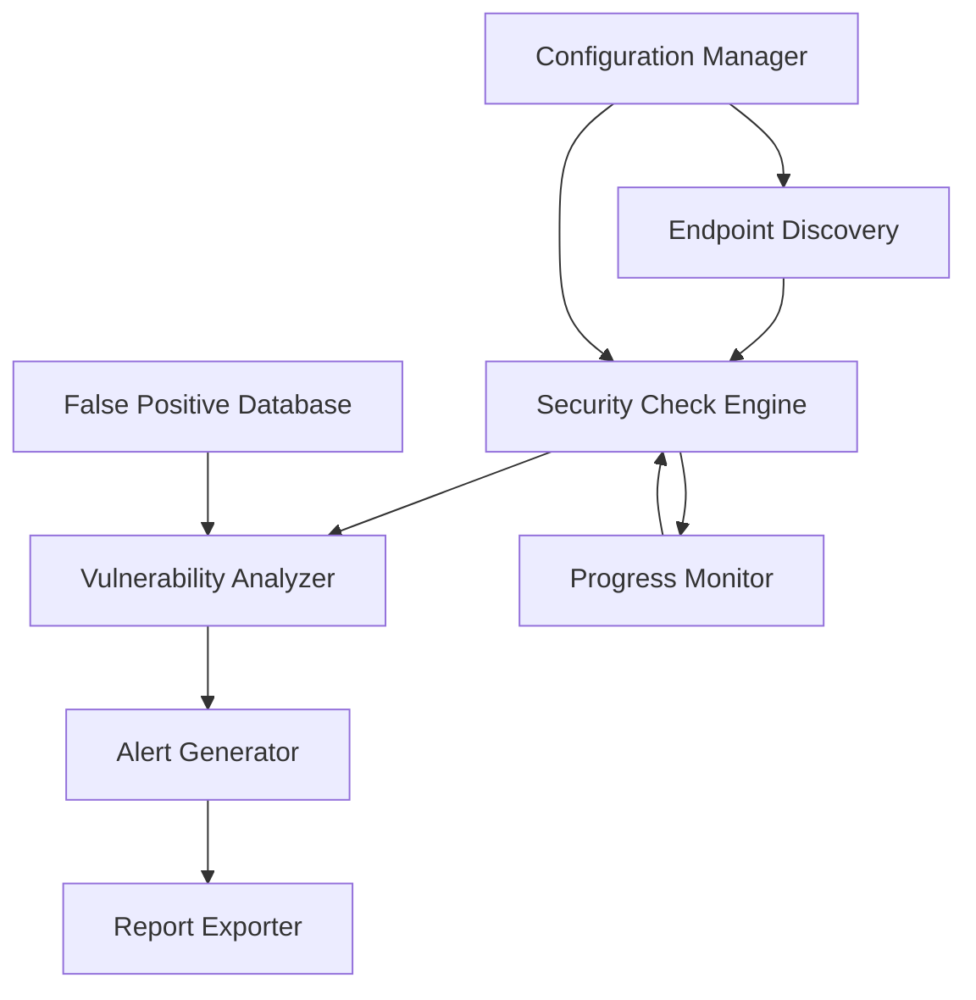

# Design Document: API Vulnerability Scanner

## Overview

The API Vulnerability Scanner is a security testing tool that performs automated vulnerability detection on REST APIs. The system follows a modular architecture with clear separation between discovery, testing, reporting, and configuration management.

The scanner operates in phases:
1. **Discovery Phase**: Enumerate API endpoints through OpenAPI specs or manual configuration
2. **Testing Phase**: Execute security checks against discovered endpoints
3. **Analysis Phase**: Evaluate results, assign severity, and calculate confidence scores
4. **Reporting Phase**: Generate alerts with remediation guidance and export reports

The design prioritizes safety (read-only by default), extensibility (pluggable security checks), and usability (clear progress tracking and actionable alerts).

## Architecture

### High-Level Architecture



### Component Responsibilities

**Configuration Manager**
- Parse configuration files
- Validate scan parameters
- Manage authentication credentials
- Handle endpoint inclusion/exclusion rules

**Endpoint Discovery**
- Parse OpenAPI/Swagger specifications
- Enumerate HTTP methods per endpoint
- Build endpoint inventory for testing
- Handle discovery failures gracefully

**Security Check Engine**
- Orchestrate execution of security checks
- Implement request throttling
- Manage dry-run mode
- Handle errors without stopping scan

**Vulnerability Analyzer**
- Evaluate security check results
- Assign severity levels
- Calculate confidence scores
- Query false positive database

**Alert Generator**
- Create structured alerts
- Include remediation guidance
- Map to OWASP API Security Top 10
- Provide evidence and affected endpoints

**Report Exporter**
- Generate scan reports
- Export to JSON, HTML, PDF formats
- Include all alerts and metadata

**Progress Monitor**
- Track scan progress
- Log security check execution
- Estimate remaining time
- Provide verbose logging option

**False Positive Database**
- Store false positive markings
- Persist across scan sessions
- Filter alerts based on history

## Components and Interfaces

### Configuration Manager

```python
class ScanConfiguration:
    """Configuration for a vulnerability scan"""
    base_url: str
    endpoints: Optional[List[str]]
    excluded_endpoints: List[str]
    security_checks: List[str]
    custom_headers: Dict[str, str]
    auth_credentials: Optional[AuthCredentials]
    severity_threshold: SeverityLevel
    dry_run: bool
    read_only: bool
    request_throttle_ms: int
    verbose_logging: bool

class ConfigurationManager:
    def load_config(self, config_path: str) -> ScanConfiguration:
        """Load and validate configuration from file"""
        
    def validate_config(self, config: ScanConfiguration) -> ValidationResult:
        """Ensure configuration is valid and safe"""
```

### Endpoint Discovery

```python
class Endpoint:
    """Represents an API endpoint"""
    path: str
    methods: List[HttpMethod]
    parameters: List[Parameter]
    authentication_required: bool

class EndpointDiscovery:
    def discover_from_openapi(self, spec_url: str) -> List[Endpoint]:
        """Parse OpenAPI/Swagger spec to discover endpoints"""
        
    def discover_from_manual(self, endpoints: List[str]) -> List[Endpoint]:
        """Build endpoint list from manual configuration"""
        
    def probe_http_methods(self, endpoint: Endpoint) -> List[HttpMethod]:
        """Determine supported HTTP methods for endpoint"""
```

### Security Check Engine

```python
class SecurityCheck(ABC):
    """Base class for all security checks"""
    
    @abstractmethod
    def check_name(self) -> str:
        """Return the name of this security check"""
    
    @abstractmethod
    def execute(self, endpoint: Endpoint, config: ScanConfiguration) -> CheckResult:
        """Execute the security check against an endpoint"""

class CheckResult:
    """Result from executing a security check"""
    check_name: str
    endpoint: str
    vulnerable: bool
    evidence: str
    raw_response: Optional[HttpResponse]

class SecurityCheckEngine:
    def __init__(self, checks: List[SecurityCheck], throttle_ms: int):
        """Initialize engine with security checks and throttling"""
        
    def execute_checks(self, endpoints: List[Endpoint], config: ScanConfiguration) -> List[CheckResult]:
        """Execute all security checks against all endpoints"""
        
    def execute_dry_run(self, endpoints: List[Endpoint], config: ScanConfiguration) -> List[str]:
        """Simulate checks without sending requests"""
```

### Specific Security Checks

```python
class AuthenticationCheck(SecurityCheck):
    """Tests for authentication vulnerabilities"""
    def execute(self, endpoint: Endpoint, config: ScanConfiguration) -> CheckResult:
        # Test missing auth, weak schemes, default credentials, token expiration

class InjectionCheck(SecurityCheck):
    """Tests for injection vulnerabilities"""
    def execute(self, endpoint: Endpoint, config: ScanConfiguration) -> CheckResult:
        # Test SQL, NoSQL, command, XML injection

class AccessControlCheck(SecurityCheck):
    """Tests for broken access control"""
    def execute(self, endpoint: Endpoint, config: ScanConfiguration) -> CheckResult:
        # Test IDOR, missing function-level control, privilege escalation

class SensitiveDataCheck(SecurityCheck):
    """Tests for sensitive data exposure"""
    def execute(self, endpoint: Endpoint, config: ScanConfiguration) -> CheckResult:
        # Test unencrypted data, HTTPS enforcement, data in errors, exposed keys

class RateLimitCheck(SecurityCheck):
    """Tests for rate limiting"""
    def execute(self, endpoint: Endpoint, config: ScanConfiguration) -> CheckResult:
        # Test absence and configuration of rate limits

class SecurityMisconfigurationCheck(SecurityCheck):
    """Tests for security misconfigurations"""
    def execute(self, endpoint: Endpoint, config: ScanConfiguration) -> CheckResult:
        # Test verbose errors, missing headers, vulnerable dependencies, unnecessary methods
```

### Vulnerability Analyzer

```python
class SeverityLevel(Enum):
    CRITICAL = "critical"
    HIGH = "high"
    MEDIUM = "medium"
    LOW = "low"
    INFO = "info"

class Vulnerability:
    """Represents a detected vulnerability"""
    type: str
    severity: SeverityLevel
    confidence: float  # 0.0 to 1.0
    endpoint: str
    evidence: str
    check_result: CheckResult

class VulnerabilityAnalyzer:
    def __init__(self, false_positive_db: FalsePositiveDatabase):
        """Initialize with false positive database"""
        
    def analyze(self, results: List[CheckResult]) -> List[Vulnerability]:
        """Analyze check results to identify vulnerabilities"""
        
    def assign_severity(self, vulnerability_type: str) -> SeverityLevel:
        """Determine severity level for vulnerability type"""
        
    def calculate_confidence(self, result: CheckResult) -> float:
        """Calculate confidence score for detection"""
        
    def filter_false_positives(self, vulnerabilities: List[Vulnerability]) -> List[Vulnerability]:
        """Remove known false positives"""
```

### Alert Generator

```python
class RemediationGuidance:
    """Remediation instructions for a vulnerability"""
    steps: List[str]
    references: List[str]
    owasp_mapping: str

class Alert:
    """Security alert for a detected vulnerability"""
    id: str
    vulnerability: Vulnerability
    remediation: RemediationGuidance
    timestamp: datetime
    requires_manual_verification: bool

class AlertGenerator:
    def generate_alert(self, vulnerability: Vulnerability) -> Alert:
        """Create alert with remediation guidance"""
        
    def get_remediation_guidance(self, vulnerability_type: str) -> RemediationGuidance:
        """Retrieve remediation steps for vulnerability type"""
        
    def map_to_owasp(self, vulnerability_type: str) -> str:
        """Map vulnerability to OWASP API Security Top 10"""
```

### Report Exporter

```python
class ScanReport:
    """Complete scan report"""
    scan_id: str
    timestamp: datetime
    configuration: ScanConfiguration
    endpoints_scanned: int
    checks_performed: int
    alerts: List[Alert]
    scan_duration: timedelta

class ReportExporter:
    def export_json(self, report: ScanReport, output_path: str) -> None:
        """Export report as JSON"""
        
    def export_html(self, report: ScanReport, output_path: str) -> None:
        """Export report as HTML"""
        
    def export_pdf(self, report: ScanReport, output_path: str) -> None:
        """Export report as PDF"""
```

### Progress Monitor

```python
class ScanProgress:
    """Current scan progress"""
    total_checks: int
    completed_checks: int
    current_endpoint: str
    current_check: str
    estimated_remaining_seconds: int

class ProgressMonitor:
    def update_progress(self, completed: int, total: int) -> None:
        """Update progress tracking"""
        
    def get_progress(self) -> ScanProgress:
        """Get current progress state"""
        
    def log_check(self, check_name: str, endpoint: str, result: str) -> None:
        """Log security check execution"""
        
    def estimate_remaining_time(self) -> int:
        """Estimate seconds remaining in scan"""
```

### False Positive Database

```python
class FalsePositiveEntry:
    """Record of a false positive"""
    vulnerability_type: str
    endpoint: str
    evidence_hash: str
    marked_by: str
    timestamp: datetime

class FalsePositiveDatabase:
    def mark_false_positive(self, alert: Alert, marked_by: str) -> None:
        """Mark an alert as false positive"""
        
    def is_false_positive(self, vulnerability: Vulnerability) -> bool:
        """Check if vulnerability is a known false positive"""
        
    def load(self, db_path: str) -> None:
        """Load false positive database from disk"""
        
    def save(self, db_path: str) -> None:
        """Persist false positive database to disk"""
```

## Data Models

### Core Data Structures

```python
from dataclasses import dataclass
from typing import List, Dict, Optional
from enum import Enum
from datetime import datetime, timedelta

@dataclass
class HttpMethod(Enum):
    GET = "GET"
    POST = "POST"
    PUT = "PUT"
    DELETE = "DELETE"
    PATCH = "PATCH"
    OPTIONS = "OPTIONS"
    HEAD = "HEAD"

@dataclass
class Parameter:
    name: str
    location: str  # query, header, body, path
    type: str
    required: bool

@dataclass
class AuthCredentials:
    type: str  # bearer, basic, api_key, oauth2
    credentials: Dict[str, str]

@dataclass
class HttpResponse:
    status_code: int
    headers: Dict[str, str]
    body: str
    response_time_ms: int

@dataclass
class ValidationResult:
    valid: bool
    errors: List[str]
```

### Vulnerability Type Mappings

The system maintains mappings between vulnerability types and their characteristics:

```python
VULNERABILITY_SEVERITY_MAP = {
    "sql_injection": SeverityLevel.CRITICAL,
    "nosql_injection": SeverityLevel.CRITICAL,
    "command_injection": SeverityLevel.CRITICAL,
    "xml_injection": SeverityLevel.CRITICAL,
    "authentication_bypass": SeverityLevel.HIGH,
    "weak_authentication": SeverityLevel.HIGH,
    "broken_access_control": SeverityLevel.HIGH,
    "idor": SeverityLevel.HIGH,
    "privilege_escalation": SeverityLevel.HIGH,
    "sensitive_data_exposure": SeverityLevel.HIGH,
    "missing_https": SeverityLevel.HIGH,
    "exposed_credentials": SeverityLevel.HIGH,
    "missing_rate_limit": SeverityLevel.MEDIUM,
    "verbose_errors": SeverityLevel.MEDIUM,
    "missing_security_headers": SeverityLevel.MEDIUM,
    "unnecessary_http_methods": SeverityLevel.MEDIUM,
}

OWASP_API_MAPPING = {
    "authentication_bypass": "API2:2023 Broken Authentication",
    "weak_authentication": "API2:2023 Broken Authentication",
    "broken_access_control": "API1:2023 Broken Object Level Authorization",
    "idor": "API1:2023 Broken Object Level Authorization",
    "privilege_escalation": "API5:2023 Broken Function Level Authorization",
    "sql_injection": "API8:2023 Security Misconfiguration",
    "nosql_injection": "API8:2023 Security Misconfiguration",
    "command_injection": "API8:2023 Security Misconfiguration",
    "sensitive_data_exposure": "API3:2023 Broken Object Property Level Authorization",
    "missing_rate_limit": "API4:2023 Unrestricted Resource Consumption",
}
```

### Database Schema

The false positive database uses a simple JSON structure:

```json
{
  "version": "1.0",
  "entries": [
    {
      "vulnerability_type": "sql_injection",
      "endpoint": "/api/users",
      "evidence_hash": "sha256_hash_of_evidence",
      "marked_by": "user@example.com",
      "timestamp": "2024-01-15T10:30:00Z"
    }
  ]
}
```


## Correctness Properties

*A property is a characteristic or behavior that should hold true across all valid executions of a system—essentially, a formal statement about what the system should do. Properties serve as the bridge between human-readable specifications and machine-verifiable correctness guarantees.*

### Property 1: Endpoint Discovery Completeness

*For any* API with a valid OpenAPI specification, parsing the specification and discovering endpoints should return all endpoints defined in the specification.

**Validates: Requirements 1.1, 1.2**

### Property 2: Discovery Failure Resilience

*For any* endpoint discovery failure, the scanner should continue execution using manually specified endpoints without terminating the scan.

**Validates: Requirements 1.3**

### Property 3: HTTP Method Discovery Accuracy

*For any* discovered endpoint, the identified HTTP methods should match the actual methods supported by that endpoint.

**Validates: Requirements 1.4**

### Property 4: Authentication Vulnerability Detection

*For any* endpoint that requires authentication, sending a request without authentication credentials should result in the scanner detecting a missing authentication vulnerability.

**Validates: Requirements 2.1**

### Property 5: Default Credentials Testing

*For any* endpoint with authentication, the scanner should attempt to authenticate using a set of common default credentials.

**Validates: Requirements 2.3**

### Property 6: Injection Test Coverage

*For any* endpoint with input parameters, the scanner should test for all injection types (SQL, NoSQL, command, XML) appropriate to the parameter context.

**Validates: Requirements 3.1, 3.2, 3.3, 3.4**

### Property 7: Access Control Test Coverage

*For any* endpoint, the scanner should test for insecure direct object references, missing function-level access control, and privilege escalation vulnerabilities.

**Validates: Requirements 4.1, 4.2, 4.3**

### Property 8: Sensitive Data Pattern Detection

*For any* API response containing patterns matching sensitive data (credentials, keys, tokens, PII), the scanner should detect and flag the exposure.

**Validates: Requirements 5.1, 5.4**

### Property 9: HTTPS Enforcement Verification

*For any* endpoint, the scanner should verify that HTTPS is enforced and flag endpoints accessible over HTTP.

**Validates: Requirements 5.2**

### Property 10: Error Message Analysis

*For any* error response from an endpoint, the scanner should analyze the message for sensitive data exposure and verbose implementation details.

**Validates: Requirements 5.3, 7.1**

### Property 11: Rate Limiting Detection

*For any* endpoint, the scanner should test for the presence and proper configuration of rate limiting by sending multiple requests.

**Validates: Requirements 6.1, 6.2**

### Property 12: Rate Limit Respect

*For any* endpoint that returns rate limiting headers, the scanner should throttle subsequent requests to stay within the specified limits.

**Validates: Requirements 6.4**

### Property 13: Security Header Verification

*For any* HTTP response, the scanner should check for the presence of security headers (CSP, HSTS, X-Frame-Options, etc.) and flag missing headers.

**Validates: Requirements 7.2**

### Property 14: Unnecessary Method Detection

*For any* endpoint, the scanner should identify HTTP methods that are enabled but not documented or necessary for the endpoint's functionality.

**Validates: Requirements 7.4**

### Property 15: Vulnerability Severity Mapping

*For any* detected vulnerability, the assigned severity level should match the predefined severity mapping for that vulnerability type (e.g., injection → critical, authentication bypass → high, missing rate limit → medium).

**Validates: Requirements 2.5, 3.5, 4.4, 5.5, 6.3, 7.5**

### Property 16: Alert Completeness

*For any* detected vulnerability, the generated alert should contain all required fields: vulnerability type, severity, affected endpoint, evidence, remediation guidance, and OWASP mapping.

**Validates: Requirements 8.1, 8.2, 8.3**

### Property 17: Report Completeness

*For any* scan session, the generated scan report should contain all alerts that were generated during the session.

**Validates: Requirements 8.4**

### Property 18: Report Export Format Support

*For any* scan report, it should be successfully exportable to JSON, HTML, and PDF formats without data loss.

**Validates: Requirements 8.5**

### Property 19: Read-Only Default Mode

*For any* scanner instance initialized without explicit configuration, the default mode should be read-only (no destructive operations).

**Validates: Requirements 9.1**

### Property 20: Destructive Operation Confirmation

*For any* destructive security check, the scanner should require explicit confirmation before execution.

**Validates: Requirements 9.2**

### Property 21: Request Throttling

*For any* scan configuration with a specified throttle interval, the time between consecutive requests should be at least the configured interval.

**Validates: Requirements 9.3**

### Property 22: Error Resilience

*For any* error encountered during a security check, the scanner should log the error and continue executing remaining checks without terminating the scan.

**Validates: Requirements 9.4**

### Property 23: Dry-Run Mode Safety

*For any* scan executed in dry-run mode, no actual HTTP requests should be sent to the target API.

**Validates: Requirements 9.5**

### Property 24: Security Check Configuration

*For any* configuration file specifying a subset of security checks, the scanner should execute only the specified checks and skip all others.

**Validates: Requirements 10.1**

### Property 25: Custom Header Application

*For any* custom headers specified in the configuration, all requests sent by the scanner should include those headers.

**Validates: Requirements 10.2**

### Property 26: Endpoint Filtering

*For any* configuration specifying included or excluded endpoints, the scanner should scan only the included endpoints and skip all excluded endpoints.

**Validates: Requirements 10.3, 10.5**

### Property 27: Severity Threshold Filtering

*For any* configured severity threshold, the scan report should include only alerts with severity at or above the threshold.

**Validates: Requirements 10.4**

### Property 28: Progress Tracking Accuracy

*For any* scan in progress, the displayed progress percentage should equal (completed_checks / total_checks) * 100.

**Validates: Requirements 11.1**

### Property 29: Security Check Logging

*For any* security check executed, an entry should be written to the log containing the check name, endpoint, timestamp, and result.

**Validates: Requirements 11.2, 11.3**

### Property 30: Verbose Logging Mode

*For any* scan with verbose logging enabled, the log should contain additional debug information beyond the standard logging output.

**Validates: Requirements 11.4**

### Property 31: False Positive Marking

*For any* alert, it should be possible to mark it as a false positive, and the marking should be stored in the false positive database.

**Validates: Requirements 12.1**

### Property 32: False Positive Filtering

*For any* alert marked as a false positive in a previous scan, it should not appear in subsequent scan reports for the same endpoint and vulnerability type.

**Validates: Requirements 12.2**

### Property 33: False Positive Persistence

*For any* false positive database, saving and then loading the database should preserve all false positive entries (round-trip property).

**Validates: Requirements 12.3**

### Property 34: Confidence Score Presence

*For any* detected vulnerability, the vulnerability object should include a confidence score between 0.0 and 1.0.

**Validates: Requirements 12.4**

### Property 35: Low Confidence Flagging

*For any* vulnerability with a confidence score below the configured threshold, the alert should be flagged as requiring manual verification.

**Validates: Requirements 12.5**

## Error Handling

The scanner implements comprehensive error handling to ensure robustness and safety:

### Discovery Phase Errors

- **OpenAPI Parse Failure**: Log error, fall back to manual endpoint configuration
- **Network Errors**: Retry with exponential backoff, log failure after max retries
- **Invalid Endpoint Format**: Skip invalid endpoint, log warning, continue with valid endpoints

### Testing Phase Errors

- **Request Timeout**: Log timeout, mark check as incomplete, continue with next check
- **Connection Refused**: Log error, mark endpoint as unreachable, continue scan
- **Unexpected Response Format**: Log parsing error, include raw response in evidence, continue
- **Rate Limit Exceeded**: Respect rate limit, wait for reset, continue when allowed
- **Authentication Failure**: Log failure, continue with unauthenticated tests if safe

### Analysis Phase Errors

- **Confidence Calculation Failure**: Default to 0.5 confidence, flag for manual review
- **Severity Mapping Missing**: Default to MEDIUM severity, log warning
- **False Positive DB Corruption**: Log error, continue without false positive filtering

### Reporting Phase Errors

- **Export Format Failure**: Log error, attempt other formats, ensure at least one format succeeds
- **File Write Permission Error**: Log error, attempt alternative output location
- **Template Rendering Error**: Fall back to plain text format, log error

### General Error Handling Principles

1. **Never terminate scan on single check failure**: Isolate errors to individual checks
2. **Always log errors with context**: Include endpoint, check name, error details
3. **Provide actionable error messages**: Suggest remediation steps for common errors
4. **Maintain scan state consistency**: Ensure partial results are still usable
5. **Safe defaults**: When in doubt, choose the safer, more conservative option

## Testing Strategy

The API Vulnerability Scanner requires comprehensive testing to ensure security checks are accurate and the system operates safely. We will employ a dual testing approach combining unit tests and property-based tests.

### Unit Testing Approach

Unit tests will focus on:

1. **Specific vulnerability examples**: Test known vulnerable patterns (e.g., SQL injection with `' OR '1'='1`)
2. **Edge cases**: Empty responses, malformed JSON, extremely large payloads
3. **Error conditions**: Network failures, timeouts, invalid configurations
4. **Integration points**: OpenAPI parsing, report export, database persistence
5. **Security check implementations**: Each security check class with known vulnerable and safe inputs

Example unit tests:
- Test that SQL injection check detects `' OR '1'='1` in query parameters
- Test that authentication check detects missing Authorization header
- Test that HTTPS check flags HTTP-only endpoints
- Test that dry-run mode doesn't send actual requests
- Test that false positive database persists entries correctly

### Property-Based Testing Approach

Property-based tests will verify universal properties across randomized inputs. Each property test will run a minimum of 100 iterations to ensure comprehensive coverage.

**Testing Library**: We will use `hypothesis` (Python) for property-based testing, which provides:
- Automatic test case generation
- Shrinking to minimal failing examples
- Stateful testing for complex scenarios
- Integration with pytest

**Property Test Configuration**:
```python
from hypothesis import given, settings
import hypothesis.strategies as st

@settings(max_examples=100)
@given(endpoint=st.from_regex(r'/api/[a-z]+', fullmatch=True))
def test_property_1_endpoint_discovery_completeness(endpoint):
    """
    Feature: api-vulnerability-scanner, Property 1: 
    For any API with a valid OpenAPI specification, parsing the 
    specification and discovering endpoints should return all 
    endpoints defined in the specification.
    """
    # Test implementation
```

**Key Property Tests**:

1. **Discovery Properties**: Generate random OpenAPI specs, verify all endpoints discovered
2. **Severity Mapping**: Generate random vulnerability types, verify correct severity assignment
3. **Alert Completeness**: Generate random vulnerabilities, verify all required alert fields present
4. **Configuration Application**: Generate random configurations, verify scanner respects settings
5. **Throttling**: Generate random throttle intervals, verify timing constraints met
6. **False Positive Round-Trip**: Generate random false positive entries, verify save/load preserves data
7. **Endpoint Filtering**: Generate random endpoint lists and exclusions, verify correct filtering
8. **Progress Calculation**: Generate random scan states, verify progress percentage accuracy

**Test Data Generators**:

We will create custom Hypothesis strategies for domain-specific types:
```python
@st.composite
def endpoint_strategy(draw):
    """Generate random API endpoints"""
    path = draw(st.from_regex(r'/api/[a-z/]+', fullmatch=True))
    methods = draw(st.lists(st.sampled_from(HttpMethod), min_size=1, unique=True))
    return Endpoint(path=path, methods=methods, parameters=[], authentication_required=draw(st.booleans()))

@st.composite
def vulnerability_strategy(draw):
    """Generate random vulnerabilities"""
    vuln_type = draw(st.sampled_from(list(VULNERABILITY_SEVERITY_MAP.keys())))
    return Vulnerability(
        type=vuln_type,
        severity=VULNERABILITY_SEVERITY_MAP[vuln_type],
        confidence=draw(st.floats(min_value=0.0, max_value=1.0)),
        endpoint=draw(st.from_regex(r'/api/[a-z]+', fullmatch=True)),
        evidence=draw(st.text(min_size=10)),
        check_result=None
    )
```

### Test Coverage Goals

- **Unit Test Coverage**: Minimum 80% code coverage
- **Property Test Coverage**: All 35 correctness properties implemented as property tests
- **Integration Test Coverage**: End-to-end scan scenarios with mock APIs
- **Security Test Coverage**: Test scanner against intentionally vulnerable test APIs (e.g., OWASP Juice Shop API)

### Testing Safety

All tests will:
- Use mock HTTP clients to avoid hitting real APIs
- Run against local test servers only
- Never test against production systems
- Include safeguards to prevent accidental destructive operations
- Verify dry-run mode works correctly before testing live mode

### Continuous Testing

- Run unit tests on every commit
- Run property tests nightly (due to longer execution time)
- Run integration tests before releases
- Maintain a suite of regression tests for fixed bugs
- Test against multiple Python versions (3.9, 3.10, 3.11, 3.12)
